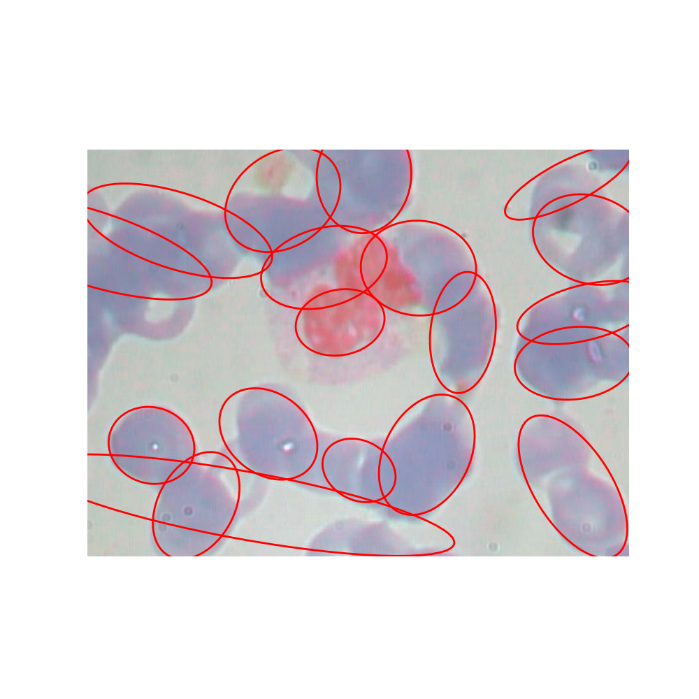
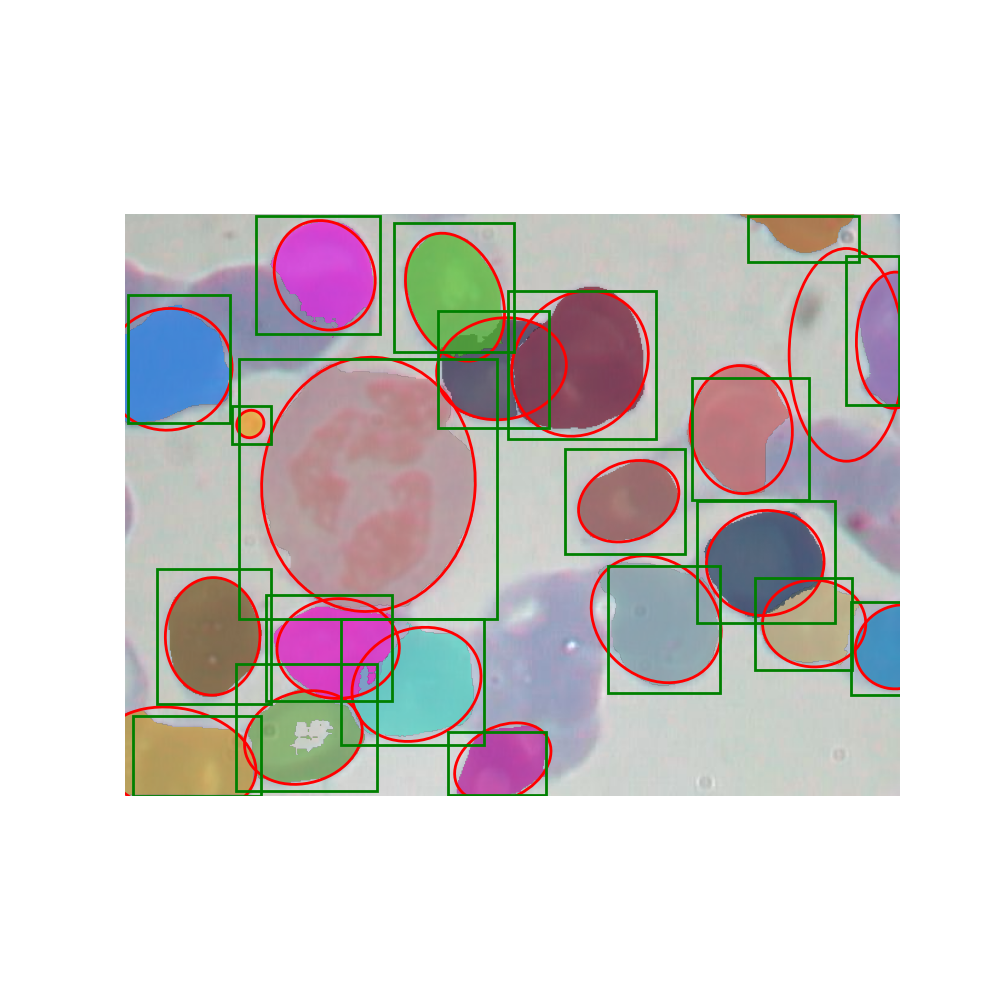
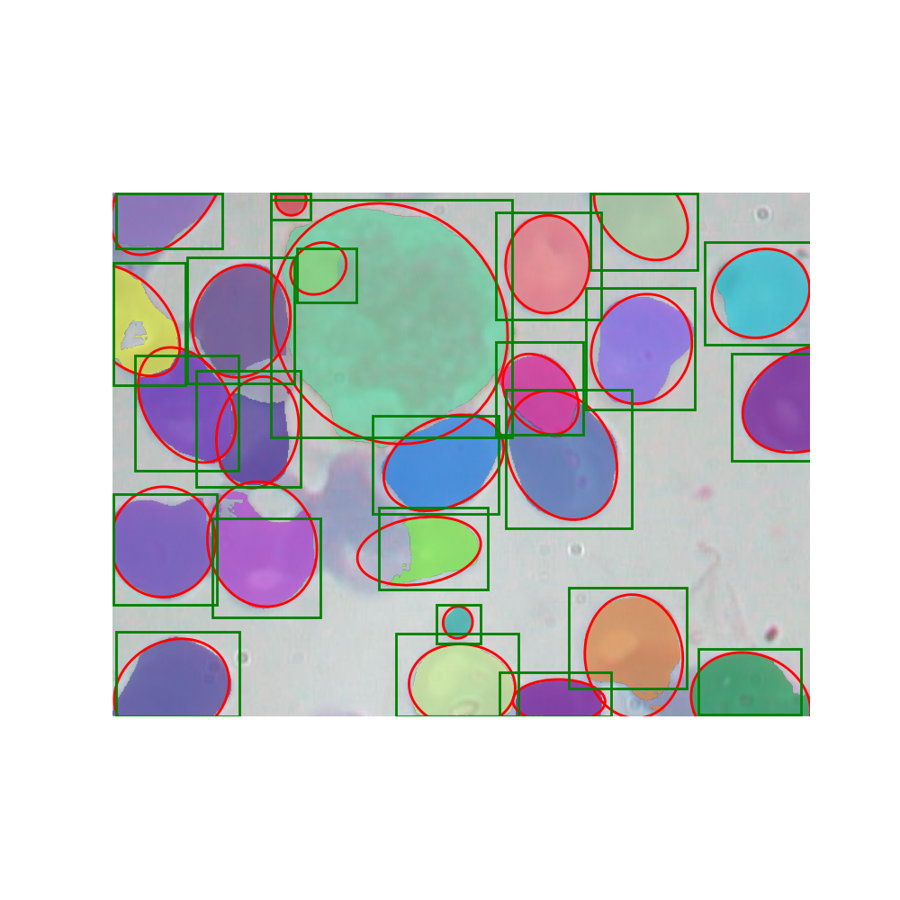
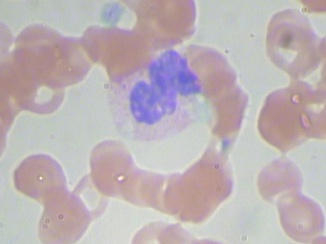
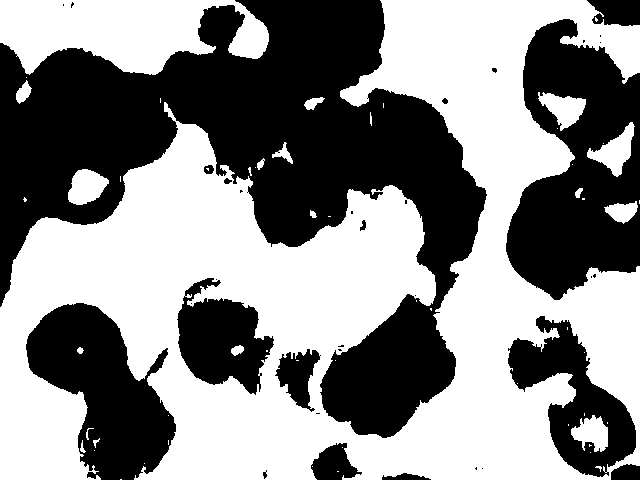
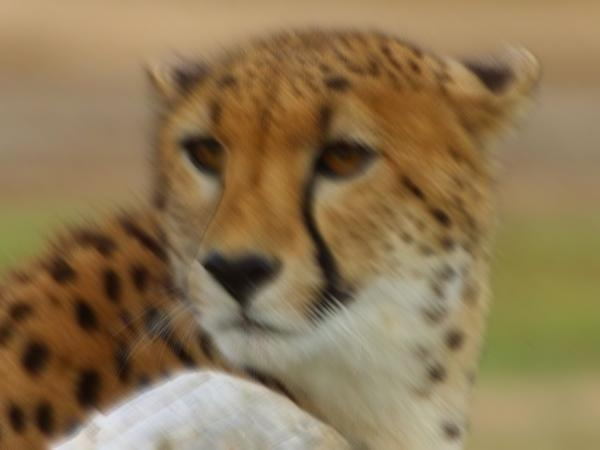

# Frenel AI HW Questions

## Setup
1. pip install -r requirments.txt
2. Download all 4 .pth files. If you choose to sae the files in a different place or with a different name,  
   You mast explicitly add thier path with the relevant flag, e.g. --sam-weights PATH_TO_SAM_WEIGHTS.  
### Download instructions per model

#### SAM
Download SAM weights from https://dl.fbaipublicfiles.com/segment_anything/sam_vit_h_4b8939.pth  
Save as ```weights/sam_vit_h_4b8939.pth```

#### DeblurGAN
Download from https://drive.google.com/file/d/1DWtz9eVf4xWrdtTmwVPZhHHqwU7j5tGQ/view?usp=drive_link  
Save as ```weights/deblur-gan.pth```

#### Swin2SR
Download from https://github.com/mv-lab/swin2sr/releases/download/v0.0.1/Swin2SR_CompressedSR_X4_48.pth
Save as weights/Swin2SR_CompressedSR_X4_48.pth

#### CST-YOLO
Download from  https://drive.google.com/file/d/1jKIVJ7Fp5U8j2ACPgTrNmQ3Oa24rl7fC/view?usp=drive_link
Save as cst-yolo-weights.pt

## Usage
implementations of my solutions to q1, q2 and q3 are in q1.py, q2.py and q3.py.  
main.py was build to run each logic using CL flags.  
Use the --debug flag to write results to ./outputs.
q1 and q3 both has 2 implemetations, a DL approach and a classic computer vision approach.  
The default is the DL approach. To use the classic one, use the --classic-cv flag.  
To use q1,q2 or q3 logics within your code, use the standalone runner. There is one in each qX.py file.  
Example usage for each question: 
```
python home_test.py --image-path BLOOD_CELL_PATH --q1 --debug
python home_test.py --image-path BLOOD_CELL_PATH --q1 --classic-cv --debug
```
```
python home_test.py --image-path BLOOD_CELL_PATH --q2 --debug
```
```
python home_test.py --image-path ./chita.jpg --q3 --debug
python home_test.py --image-path ./chita.jpg --q3 --classic-cv --debug
```
q4 is answered at the end of this file
## Q1
BGMM is classic for this type of question, but as I was given here a labeled dataset I've also implemented a DL based solution.
The code support both implementations. Default is the DL solution, to run the BGMM, use the --classic-cv flag 

### BGMM
1. Downscale the input image X4 to speed up the BGMM runtime
2. Turn to grayscale
3. Threshold the image with Otsu
4. Relevant pixels are black ones. Arrange all their indexes in a N*2 matrix
5. Run BGMM using sklearn. Set max component number to 50
6. Use the model to cluster the pixel indexes
7. For each cluster
   8. Make a mask image of this cluster
   9. Fit an ellipse to it using cv2.convexHull & cv2.FitEllipse

#### BGMM results


### DL Solution: CST-YOLO + SAM
#### CST-YOLO
From a brief search in the net I came across this CST-YOLO github project https://github.com/mkang315/CST-YOLO,
which looks like a perfect fit.
No pretrained models were provided here, so I had to train it myself.
I could only fit batch_size=8 on my GPU, so I got 0.5mAP of 0.904,
a little lower than the 0.927 they report on the project's page, but still a great detector.
The code, almost unmodified is in ./CST-YOLO.

#### SAM
Using https://github.com/facebookresearch/segment-anything with the CST-YOLO results as prompts produced out-of-the-box good segmentations.

#### Eliipses
Once I had instance segmentations of the blood cells, I took each instance mask as binary image,
and used cv2.convexHull & cv2.fitEllipse to find it's best fit.
The main issue I've found in this pipeline are some miss detections of CSV-YOLO.
If I had the time and resorces, I would improve it by:
1. Training it with a larger batch size
2. The dataset labels aren't perfect. I would iteratively use the trained model to spot issues in the train dataset, fix and re-train

### DL Solution: Examples from the test
#### BloodImage_00011


#### BloodImage_00015


## Q2

Using Otsu gave good binary images, so I didn't try anything extra.
### Original


### Binary


## Q3

Here I've tried Non-Local Means Denoising, and got interesting result, but I wanted something better.
So I've used a combination of deblur-GAN and swin2sr:
I've downscaled the image X4, fed it to the DeblurGAN & gave the result to the Swin2SR to upscale it back.
The code support both implementations. The default is DeblurGAN + Swin2SR. To use FastNlMeansDenoisingColored, run with --classic-cv flag
### DeblurGAN + Swin2SR


### FastNlMeansDenoisingColored


### Original image


## Q4

#### A
p1(1,2,-2), p2(3,4,-6), p3(5,6,-10), p4(23,24,-46)
v1 = p2-p1 = (2,2,-4)
v2 = p3-p1 = (4, 4, -8)
v2 = 2*v1 -> p1,p2,p3 are collinear
v3 = p4-p1 = (22, 22, -44)
v3 = 11*v1 -> p1,p2,p3,p4 are collinear
A is not a plane, but a line.
A = (1+a, 2+a, -2-2a)

#### B
p1(7,9,-3.5), p2(9,10,-4.5), p3(11,12, -5.5), p4(13,14, -6.5)   
v1 = p1-p2 = (2, 1, -1)
v2 = p3-p1 = (4, 3, -2)
v_norm_b = (1, 0, 2)
varify that p4 on the same plane:
v3 = p4-p1 = (6, 5, -3)
v3 dot v_norm_b = 0 -> p4 is on the same plane as p1,p2,p3
B plane equation: 1(x-7)+0(y-9)+2(z+3.5) = 0 -> x + 2z = 0

#### C
p1(15,16, -0.0033333), p2(17, 18, -0.00294118 ), p3(19, 20, -0.00263158 ), p4(21, 22 -0.0023809,)
v1 = p1-p2 = (2,2, 0.00039212000000000014)
v2 = p3-p1 = (4, 4, 0.0007017199999999999)
v_norm_c = (-0.00016504000000000085, 0.00016504000000000085, 0) = (-1, 1, 0)
varify that p4 on the same plane:
v3 = p4-p1 = (6, 6, -0.0057142)
v3 dot v_norm_c = 0 -> p4 is on the same plane as p1,p2,p3
C plane equation: -1(x-15)+1(y-16)+0(z-(-0.0033333)) = 0 -> -x + y = 1

#### B and C intersection line
v_norm_b = (1, 0, 2)
v_norm_c = (-1, 1, 0)
v_norm_b X v_norm_c = (-2, 2, 1)
Now let's find a point on that line by finding a point on both planes:
let's take x=0. From B, x+2z=0 -> z=0. From C, -x + y = 1 -> y = 1
p_intersect = (0, 1, 0)
bc_intersection_v = (-2t, 1+2t, t)


#### Now find it's intersection point with A
Extract a & t from the following top 2 equations:
```
(E1) 1+a = -2t
(E2) 2+a = 1+2t
(E3) -2-2a = t
(E1+E2) 3+2a = 1 -> a = -1
(E1) 1 -1 = -2t -> t = 0
Varify intersection using E3
(E3) -2-2(-1) = 0 -> 0 = 0
```
#### So point of A,B,C intersection is (0, 1, 0)


